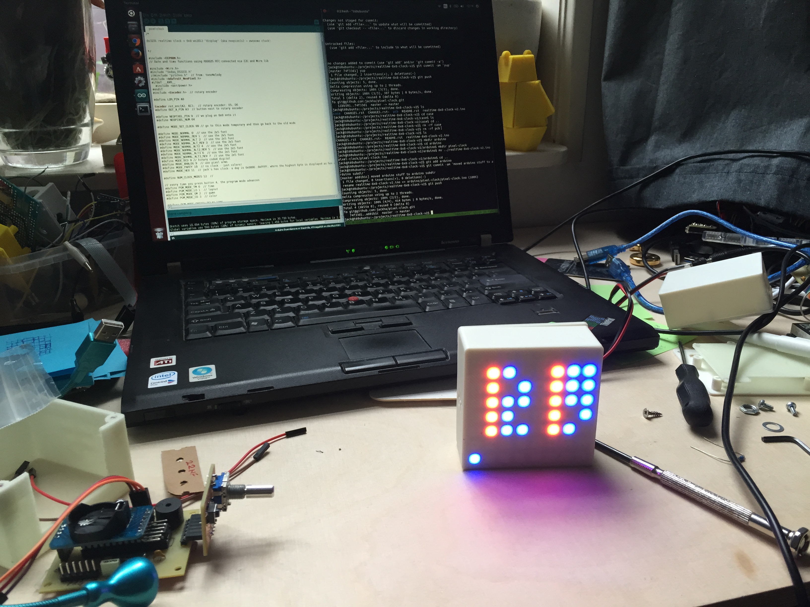

Pixel Clock
-----------

A pixel clock with an 8x8 rgb led display based on Arduino.

- Atmega 328 microcontroller
- DS3231 realtime clock module
- ws2812 8x8 LED display aka NeoPixel.
- Control using a rotary encoder /w button.

The case consist of a front and a back part. It is modeled in OpenSCAD.

The pcb is designed in Eagle.

All is work in progress. You can follow the project:

http://jh-interact.blogspot.nl/

http://www.thingiverse.com/thing:1372109

Arduino dependencies
--------------------

Tested and working with these libraries. Many thanks to the authors
for creating and sharing them!!

- Sodaq_DS3231 by keestux, 1.2.0

- Adafruit NeoPixel 1.0.4

- Adafruit GFX Library 1.1.4

- Encoder by Paul Stoffregen 1.4.0

License
-------

Open source hardware and software :-) Please follow my License as I put time
and effort in this project. Thanks!

https://creativecommons.org/licenses/by-nc/3.0/
Attribution-NonCommercial 3.0 Unported (CC BY-NC 3.0)
